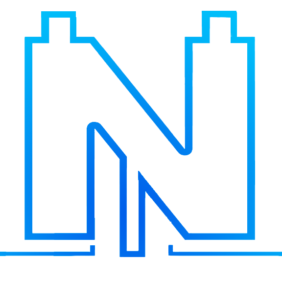

     
    
     

## Noobcash Project
Noobcash represents a straightforward cryptocurrency framework characterized by full decentralization. It operates as a digital currency without requiring a central governing body. Transactions within the system undergo validation through a network of nodes and are then logged on a publicly accessible distributed ledger known as the Noobcash Blockchain. The nodes within this system engage in communication through a peer-to-peer network, employing cryptographic techniques to ensure the integrity of verification processes.

